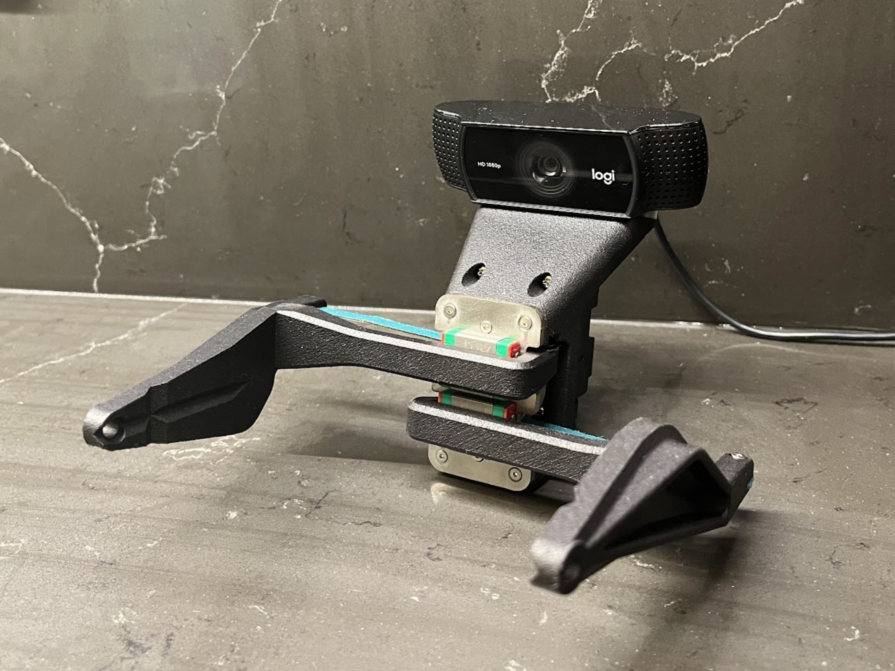

# OpenGrip

### a simple, low-cost, robotics gripper

  
  

## overview

robotics grippers are often expensive, bulky, and challenging to integrate. OpenGrip offers a solution that is both affordable and user-friendly, without compromising on performance. 

### features

- **low cost**: by using only 5 custom parts and affordable hardware, OpenGrip significantly reduces costs, making it accessible for a wide range of users and applications

- **simple**: no belts, linkages, or gears - and constant force springs prevent collisions from damaging the gripper

- **high performance**: despite its cost-effectiveness, OpenGrip competes with the performance of grippers that are up to 50 times more expensive

- **adjustable compliance**: by using different winch materials (Nylon, Rubber, etc.) the compliance of the grasp can be adjusted

- **ease of use**: the Dynamixel servo motor makes OpenGrip extremely user-friendly. It can be controlled through ROS or any other Dynamixel-compatible control methods

## getting started

Assembly instructions can be found [here](https://docs.google.com/presentation/d/1iBIFQ8Uv3fJxjH3Wcjm2KIDGo_j1fCUzhZIH-ikzjmM/edit?usp=sharing)

BOM can be found [here](https://docs.google.com/spreadsheets/d/18ndGbQFCbwUeQNG1r3dqTShQs4zwCBGkiXpTbjC0DrM/edit?usp=sharing)
